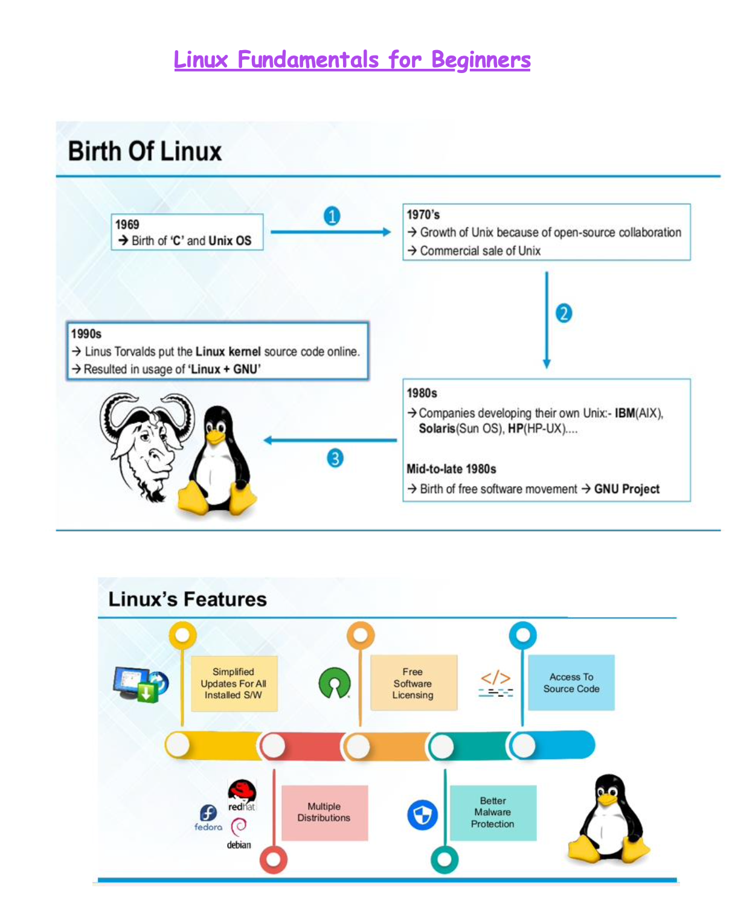

# Linux Basics &#129312;
Linux® is an open source operating system (OS). An operating system is the software that directly manages a system's hardware and resources, like CPU, memory, and storage. The OS sits between applications and hardware and makes the connections between all of your software and the physical resources that do the work.

Linux is a family of free and open-source operating systems based on the Linux kernel. Operating systems based on Linux are known as Linux distributions or distros. Examples include Debian, Ubuntu, Fedora, CentOS, Gentoo, Arch Linux, and many others.

The Linux kernel has been under active development since 1991, and has proven to be extremely versatile and adaptable. You can find computers that run Linux in a wide variety of contexts all over the world, from web servers to cell phones. Today, 90% of all cloud infrastructure and 74% of the world’s smartphones are powered by Linux.

However, newcomers to Linux may find it somewhat difficult to approach, as Linux filesystems have a different structure than those found on Windows or MacOS. Additionally, Linux-based operating systems depend heavily on working with the command line interface, while most personal computers rely on graphical interfaces.
 
 
 
 
This browser does not support PDFs. Please download the PDF to view it: <a href="https://media-exp1.licdn.com/dms/document/C561FAQGIIgGDnRX9sQ/feedshare-document-pdf-analyzed/0/1629970078779?e=1630058400&v=beta&t=CjBiKMmFvTUk_vY3HEZZXoJbNuA4jCGoK0mMrYc0aRM">Download PDF</a>.

  